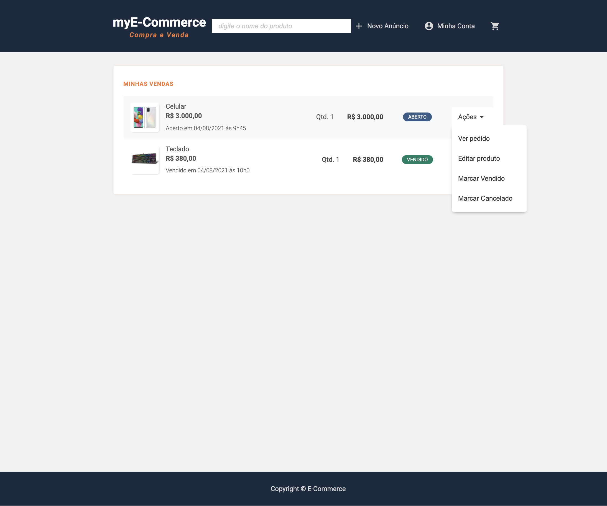

<h1 align="center">myE-Commerce</h1>
<p align="center">Site tradicional para anúncio, compra e venda de produtos</p>

<p align="center">:coffee:</p>

<p align="center">
  <a href="#principais-funcionalidades">Funcionalidades</a> &#xa0; | &#xa0; 
  <a href="#status">Status</a> &#xa0; | &#xa0;
  <a href="#tecnologias">Tecnologias</a> &#xa0; | &#xa0;
  <a href="#fluxo-em-imagens">Imagens</a> &#xa0; &#xa0; | &#xa0;
  <a href="#executando-o-projeto-na-sua-máquina">Executando</a> &#xa0; &#xa0;
</p>

---

</br>
<h2>Principais Funcionalidades</h2>
- Autenticação/login por email e senha</br>
- Recuperação de senha por e-mail</br>
- Busca de produtos por nome e categoria</br>
- Anúncio de produtos com imagens e atualizações</br>
- Cadastro de usuários</br>
- Carrinho de compras com os items a serem comprados com as respectivas informações e total da compra</br>
- Animações de sucesso ou falha da compra</br>
- Envio de e-mail para o vendedor com os dados do pedido e do usuário interessado na compra</br></br>

<h2>Status</h2>
Refatoração e melhorias</br></br>

<h2>Tecnologias utilizadas</h2>
- JavaScript</br>
- CSS</br>
- HTML5 (Nunjucks)</br>
- NodeJS</br>
- PostgreSQL</br></br>

<h2>Fluxo em imagens</h2>

| Login |
|-------|
||

| Formulário para solicitar redefinição de senha | E-mail enviado para redefinição de senha |
|-------|-------|
|||

| Formulário para redefinir a senha | Senha redefinida com sucesso |
|-------|-------|
|||

| Cadastro de produto | Detalhes do produto |
|-------|-------|
|||

| Carrinho de compras | Animação de confirmação do pedido |
|-------|-------|
|||

| E-mail enviado para o vendedor comunicando o interesse de compra | Busca de produto por nome |
|-------|-------|
|||

| Configurações do usuário | Visualização das vendas do usuário |
|-------|-------|
|||

</br>
<h2>Executando o projeto na sua máquina</h2>

Rodar os seguintes comandos na pasta do projeto:
```bash
# Install dependencies
$ npm install

# Run the project
$ npm start

# The server will initialize in the <http://localhost:5000>
```


